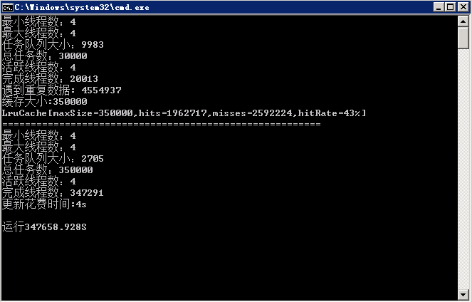

# 知乎爬虫

## 博客更新地址:[http://sweets.cf](http://sweets.cf/2016/11/23/%E7%9F%A5%E4%B9%8E%E7%88%AC%E8%99%AB%E4%B9%8B%E5%BC%80%E7%AF%87/) 
## 知乎专栏更新地址[https://zhuanlan.zhihu.com/Accelerator](https://zhuanlan.zhihu.com/Accelerator) 
### 1. Git求Star~O(∩_∩)O哈哈~~
### 2. 知乎求关注~~[知乎账号@Accelerator](https://www.zhihu.com/people/Sweets07)
### 3. 本git只包含爬虫部分,web服务器和可视化部分另外单开.
在知乎看到一个可视化话题的文章，所以一时心血来潮，打算用Java也写一个爬虫并且集成到Spring中，结合ECharts生成人物关系，当然，既然爬一次，个人信息也都要获取到。
那么今天起起(结束日未知，目录也会根据实际情况进行更新)，我将写一个系列的爬取知乎的爬虫文章，一直到数据可视化完成（完成后，爬虫部分将使用Scala重写）。

附赠之前爬取的数据一份(mysql): 链接: http://pan.baidu.com/s/1qXGa8S8 密码: t2vi（只下载不点赞，不star，差评差评~蓝瘦香菇）

1. 使用多线程加速

#
## 1. 预计可视化部分包括
1. 人物关系可视化
2. 人员地理分布可视化
3. 人员大学分布可视化
4. 男女比例可视化
5. 用户点赞可视化

## 2. 预计内容和目录
1. [开篇感言](https://zhuanlan.zhihu.com/p/23906171)
2. [爬虫流程设计](https://zhuanlan.zhihu.com/p/23906423)
    1. 如何过滤重复数据
    2. 如何在爬取时创建人物关系
3. [请求分析](https://zhuanlan.zhihu.com/p/23969440)
    1. 登陆请求分析
    2. 跟随/关注请求分析
4. [抓取页面数据](https://zhuanlan.zhihu.com/p/24309888)
    1. jsoup抽取页面内容
5. 优化
    1. 使用多线程加速
    2. 使用队列减少数据库访问
    3. 实现LRU提高缓存命中率
6. 基于SpringCloud的简单应用
    1. 介绍
    2. 简单配置
7. 扩展内容
    1. 整合Mybatis
    2. 编写Jsonp跨域请求API
8. 走起苦逼的前端
    1. 使用Bootstrop布局
    2. 引入ECharts图形库
9. 再见，吹牛结束。

# 吾爱Java(QQ群):[170936712（点击加入）](https://link.zhihu.com/?target=https%3A//jq.qq.com/%3F_wv%3D1027%26k%3D41oCCMn)

#更新记录:
1. 2016/11/30
    1. 第一次上传
2. 2016/12/13
    1. 修复线程过多导致内存爆炸问题
3. 2016/12/22
    1. 修复数据库死锁问题
    2. 更简单没水平的LruCache
    3. 完善了初始化爬虫选择数据问题
4. 2016/12/26
    1. 修复多线程死锁问题
5. 2016/12/28
    1. 完善登陆流程
    2. 修复增加follower问题
    3. 修复更新数userBase据过慢问题
    4. 减少cpu占用
    5. userInfo表增加两个字段

    
## 部分截图
